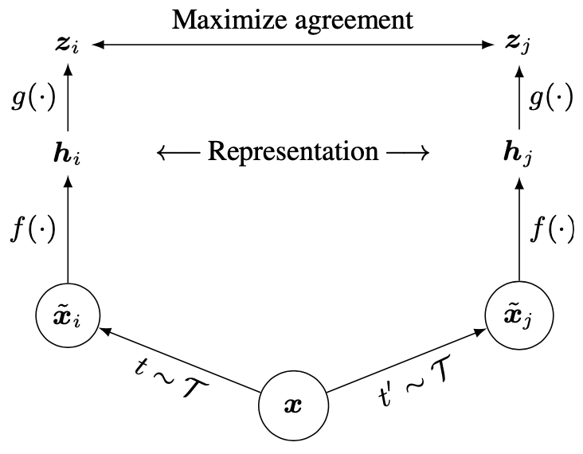

# SCAN: Learning to Classify Images without Labels
## Introduction 

this is a PyTorch implementation of the paper: [SCAN: Learning to Classify Images without Labels]('https://arxiv.org/pdf/2005.12320.pdf'), many people want to train this algrithm on their custom dataset, this is what this repo for.


## Requirements
```
    pip install faiss-cpu
    pytorch 
    torchvision
```
## Open in colab
* ***train.ipynb*** to train
* ***explore.ipynb*** to test acc of model

## Results

|  step   | acc  | model|
|  ----  | ----  | ----|
| kmeans after pretext  | 0.3466 | [pretext](https://drive.google.com/file/d/1-Ib1HJv9tmk0ckqRMwQdGMdFTPjV_9EW/view?usp=sharing)|
| scan  | 0.7562 |[scan](https://drive.google.com/file/d/1-CAwZ7FGH8CH6es0ie0l_07U8N9pXjgI/view?usp=sharing)|
| selflabel  | 0.841 |[selflabel](https://drive.google.com/file/d/1-QKepjxMBSFvcRwt48SU6PAorKmHhjBo/view?usp=sharing)|

## Usage

### fold structure
```
    |-- src_py
        |-- training_loops.py # src files
        |-- losses.py
        ... # other src files
        ...
    |-- configs
        |-- base_config.py # train test fold path
        |-- config_simclr.py # hyperparamter settings
        |-- config_extract_features.py
        |-- config_scan.py
        |-- config_selflabel.py
    |-- simclr.py
    |-- extract_features.py
    |-- scan.py
    |-- selflabel.py
```
## training on custom dataset
In oder to train on custom dataset (i assume that custom dataset do not have any labels), my setting are as follows:
1. i did not split validation set since vadiation set is meaningless when there are no labels.
2. i remove the validation steps in official repo.

what you need to modify is most about the custom dataset class.
1. in **src_py/datasets.py**, you need to change the **BaseData** class, function of this class is to return a single image from dataset, the **transform** variable in it is to prepare an image for later transform, its function can be resize all image to the same size for example. noting that we have separate transfrom for simclr, scan training, this transform is just meant to do some very basic transform.
2. in **src_py/transforms.py**, you need to modify it according to your custom dataset, such as mean, std, img size...
3. modify **config_simclr/scan/selflabel** to set all kinds of hyperparameters
* code will mkdir **./ckp** for checkingpoints, **./logs** for log files


### running
* run pretext task
```    
    python simclr.py
```
* extract features and find k nearest neighbors
```
    python extract_features.py
```
* run scan
```
    python scan.py
```
* run selflabel
```
    python selflabel.py
```

after all these steps, the training steps are done. **noting that i have a train.ipynb cover all these steps**, please check it. after training steps, for testing, the model will automatically classify test images, but you need to manually label them, i have **explore.ipynb** to cover test steps, please check it too. 


## What havn't done yet
1. from ImageNet Dataset, the pretext task should be [MOCO](https://github.com/facebookresearch/moco).
2. ...

## Method
it is a three step algorithm (pretext, scan, selflabel):
### step1: pretext
use contrastive learning (simclr in this implementation for small datasets such as cifar-10, cifar-20, stl-10) to learn feature representation.


$$L_{q,k^+,k^−} = − log \frac{exp(q·k^+/\tau)}{exp(q·k^+/\tau ) +\Sigma _{k^-} exp(q·k^−/\tau )}$$

* ResNet18 as backbone, output of the backbone is (batch_size, 512).
* the projection heads output shape is (batch_size, 128).
* image augmentation is important.

### extract nearest neighbors
after the feature representation learning, we use the learned model to extract training set images' features, and find k nearest neighbors for each image.

* use the output of projection head instead of backbone to find nearest neighbors in this implementation.

### step2: scan
assigned each image and its' neighbors to the same class.

* resnet18 as backbone (for faster training, load weights of the backbone in pretext task step), with a classfication head.
* ***overcluster***: you should know approximate number of classes of the dataset, this dataset has 5 classes, but you can create more than 5 classes (10 for example) to make sure that your model coveres all classes, for imbalanced dataset, this is even a must in my opinion.
* the actual implementation is: for one image, randomly pick up one neighbor image then assign them to the same cluster.
* this step may introduce noise, because the image and its some neighbors may not belong to the same class.
$$
\Lambda = − \frac{1}{D}\Sigma _{X \in D} \Sigma _{k \in N_X} log<\Phi_{\eta}(X), \Phi_{\eta}(k)> + \Lambda \Sigma _{c\in C}\Phi_{\eta}^{'c} log \Phi_{\eta}^{'c},
\\
with\ \Phi_{\eta}^{'c} = \frac{1}{|D|} \Sigma _{X\in D} \Phi_{\eta}^{c}(X)
$$

### step3: selflabel
in each class, pick the samples with probability > threshold 0.95 for example, then update model using the pseudo label apporch.


## Reference
[official repo](https://github.com/wvangansbeke/Unsupervised-Classification)
